University: [ITMO University](https://itmo.ru/ru/)<br />
Faculty: [FICT](https://fict.itmo.ru)<br />
Course: [Network programming](https://github.com/itmo-ict-faculty/network-programming)<br /> 
Year: 2025/2026<br />
Group: K3321<br />
Author: Stafeev Ivan Alekseevich<br />
Lab: Lab1<br />
Date of create: 16.03.2026<br />
Date of finished: 20.03.2026<br />


# Лабораторная работа №1. Установка CHR и Ansible, настройка VPN

**Цель работы**: развертывание виртуальной машины на базе платформы Microsoft Azure с установленной системой контроля конфигураций Ansible и установка CHR в VirtualBox

**Ход работы**: 1) развернуть виртаульную машину с помощью Microsoft Azure или другого сервиса; 2) создать виртуальную машину с CHR на VirtualBox; 3) создать Wireguard-сервер для организации VPN-сервера между серовом с Ansible и ВМ с CHR; 4) поднять VPN-туннель, проерить связность. 

### Часть 0. Создание ВМ с CHR

Начнем с самого простого. С сайта [Mictotik'а](https://mikrotik.com/download) был скачан образ виртуального жесткого диска с CHR, который был добавлен в виртуальную машину, созданную через VirtalBox.

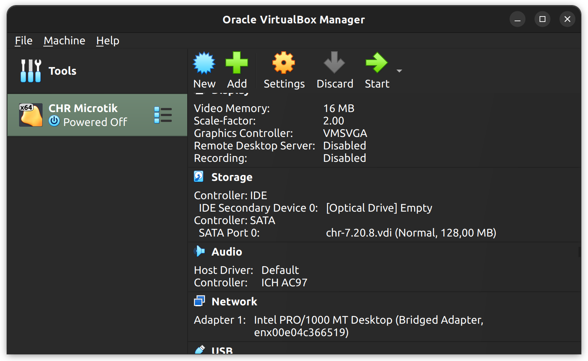

Чтобы подклюбчить роутер к сети, нужно в настройках ВМ в разделе сети выбрать `Bridge Adapter` с нужным интерфейсом. 

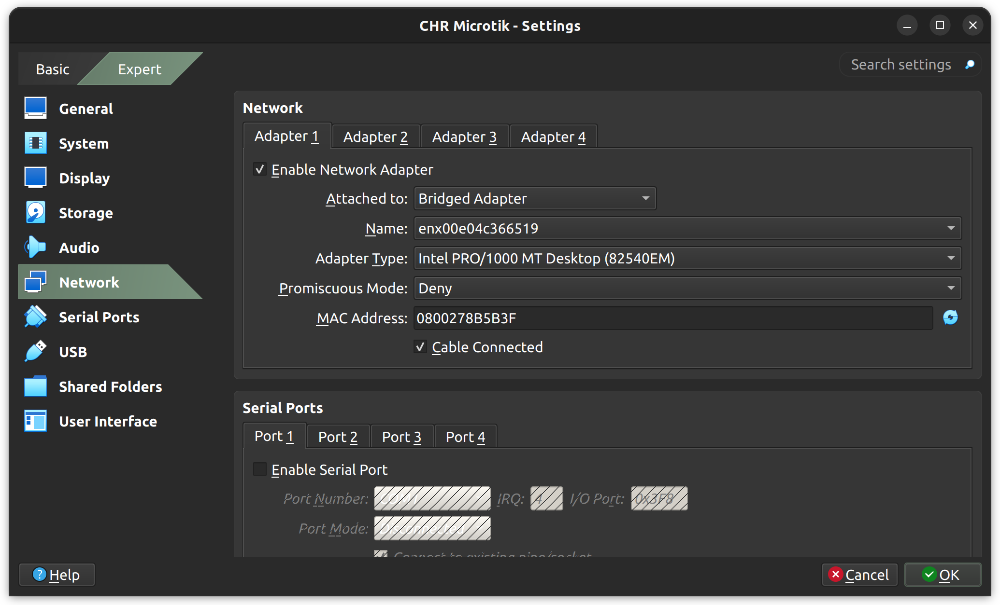

После первого логина и установки нового пароля можно проверить, что роутер имеет доступ к сети.

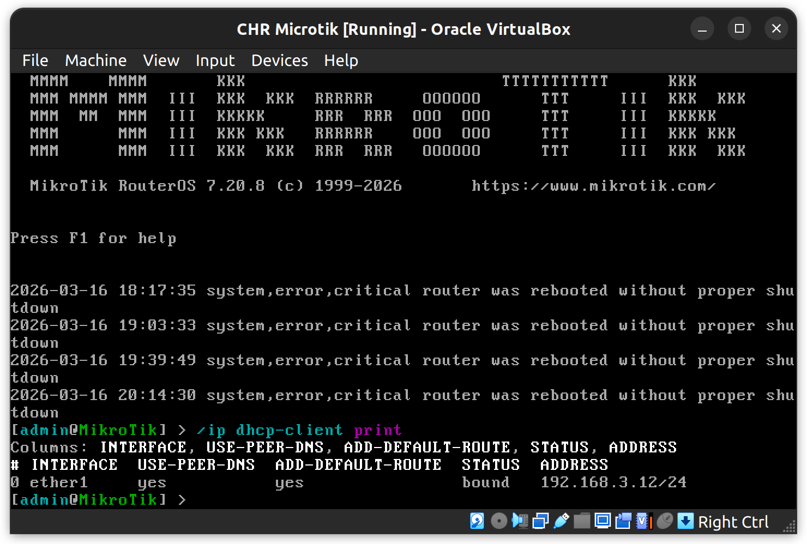

### Часть 1. Пробуем все настроить локально

Поскольку для регистрации в Microsoft Azure, AWS, Oracle и других провайдерах облачных услуг нужно вводить данные зарубежной банковской карты, коей у меня нет, было принято решение вначале настроить хостовую машину как VPN-сервер, а потом для честности арендовать на час сервер, куда загрузить уже готовые конфиги.

#### Конфигурация Wireguard на VPN-сервере

Первым делом разберемся с VPN-сервером. Устанавливаем wireguard и создаем и сохраняем ключи с помощью команд `wg genkey` и `wg pubkey` (они будут лежать в `/etc/wireguard/keys`).

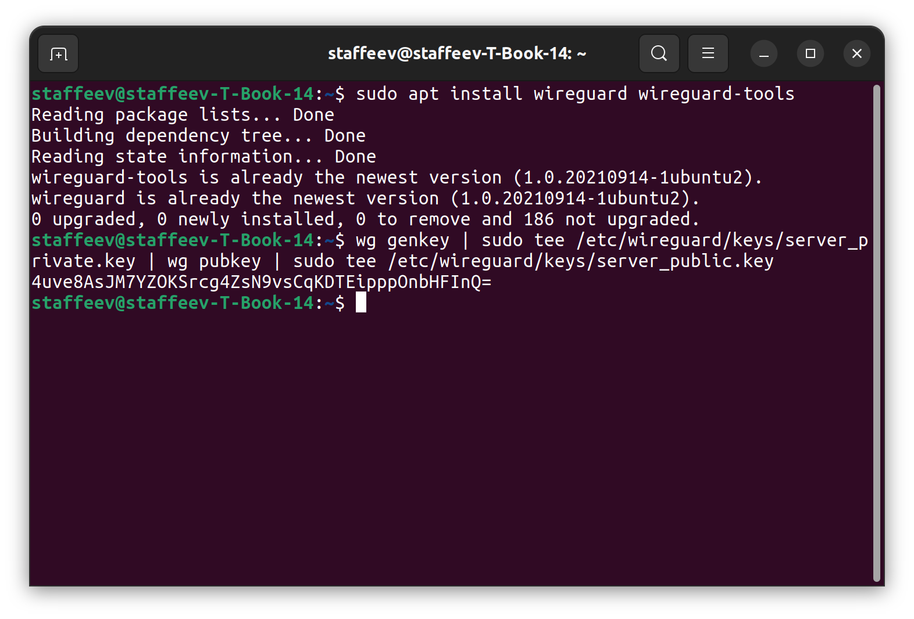

Условимся здесь, что для организации VPN-туннеля у нас будет использована сеть `10.10.0.0/24`, а прослушиваемый порт - `51820` (стандартный порт Wireguard).

Следом необходимо создать конфигурационный файл `net-lab1.conf` в папке `/etc/wireguard/`:

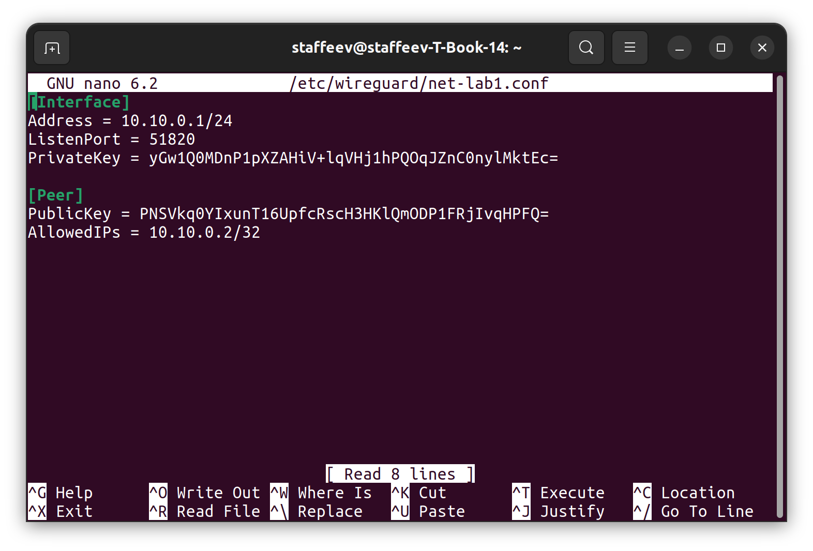

Здесь в интерфейсе указываем адрес сервера, пусть он будет `10.10.0.1/24`, порт и приватный ключ. В пире указываем публичный ключ пира (то есть нашего CHR, об этом позже) и разрешенные айпи (пусть адрес пира будет `10.10.0.2/32`).

#### Конфигурация Wireguard на CHR

Для настрнойки Wireguard на CHR нужно сделать несколько простых шагов. Создаем интерфейс wireguard'а и присваиваем ему нужны ip-адрес:

```
/interface wireguard
add listen-port=51820 name=wireguard0
/ip address
add address=10.10.0.2/32 interface=wireguard0
```

После создания интерфейса автоматические будут созданы приватный и публичный ключи (что видно на картинке). Публичный ключ нужно вставить в конфиг на VPN-сервере в [Peer]

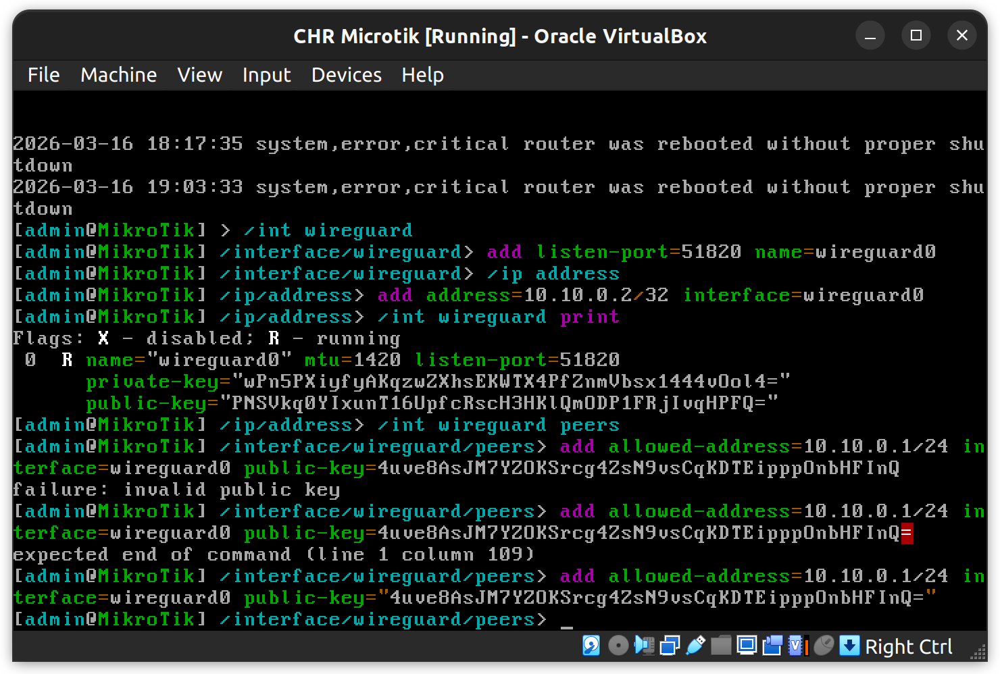

Далее добавим пира (хостовый VPN-сервер). Здесь указываем адрес пира, адрес эндпоинта (то есть "белый" айпи сервера), порт, публичный ключ.

```
/interface wireguard peers
add allowed-address=10.10.0.1/24 interface=wireguard0 public-key="<KEY>" endpoint-address=192.168.3.2 endpoint-port=51820
```

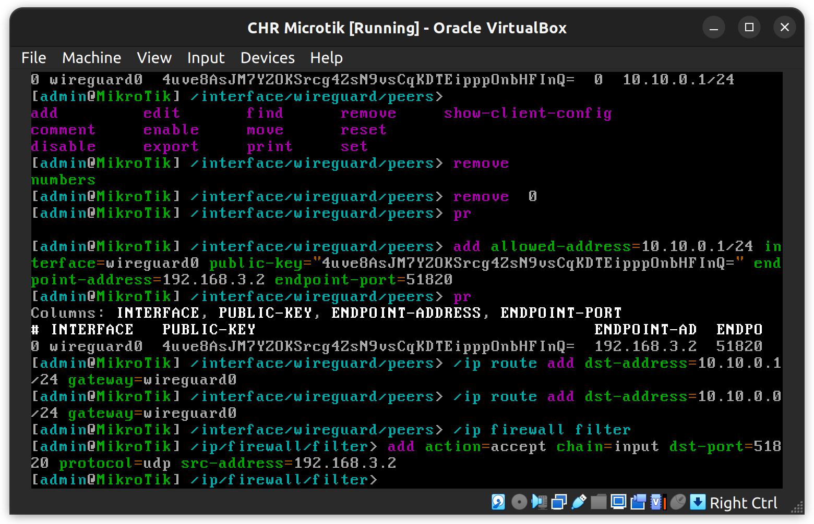

Через вывод `print` видно, что пир добавился. Для полной настройки осталось два момента.

Необходимо прописать маршрут к подсети `10.10.0.0/24` через шлюз `wireguard0`:

```
/ip route
add dst-address=10.10.0.0/24 gateway=wireguard0
```

И настроить фаерволл, так как по умолчанию фаерволл RouteOS будет блокировать туннель:

```
/ip firewall filter
add action=accept chain=input dst-port=51820 protocol=udp src-address=192.168.3.2
```

На этом настройка CHR заершена.

#### Проверка работоспособности

Чтобы поднять туннель, нужно запустить сервис wireguard через

```
sudo systemctl enable wg-quick@net-lab1.service
sudo systemctl start wg-quick@net-lab1.service
```

Через `sudo systemctl status wg-quick@net-lab1.service` и `sudo wg show` можно посмотреть, что туннель поднялся, и какие пиры подключены.

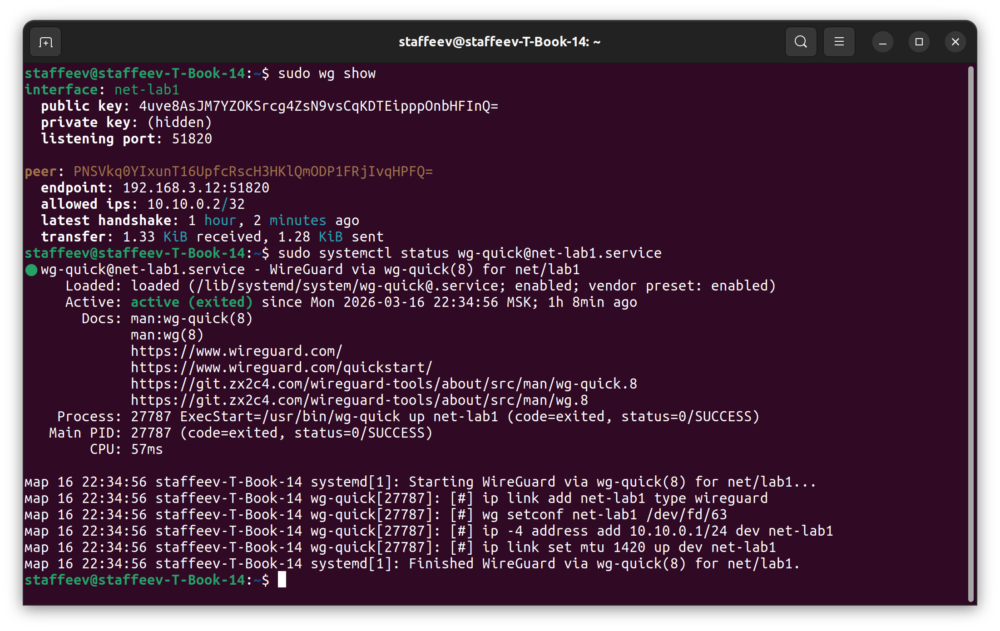

Проверка связности на сервере:

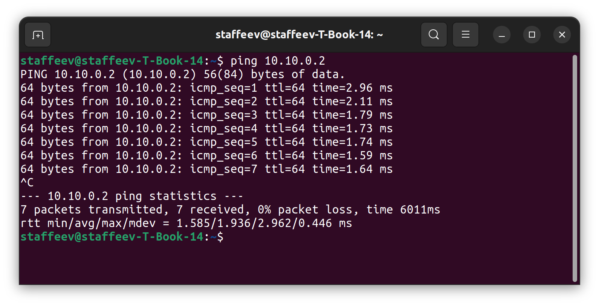

Проверка связности на CHR:

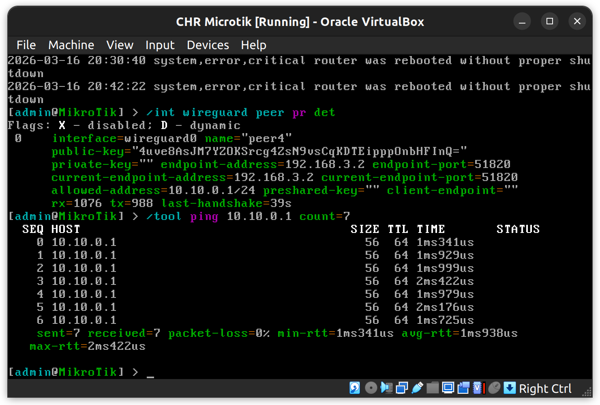

Все работает.


### Часть 2. Берем настоящий сервер

Локально все настроить получилось, значит, созданные конфиги с небольшими изменениями могут быть применены для работы с выделенным сервером. 

Для быстрой настройки создадим общий конфиг настройки VPN-сервера:


```bash
#!/bin/bash

sudo apt install python3-pip
sudo pip3 install ansible

sudo apt install wireguard wireguard-tools
sudo mkdir /etc/wireguard/keys
wg genkey | sudo tee /etc/wireguard/keys/server_private.key | wg pubkey | sudo tee /etc/wireguard/keys/server_public.key

sudo sysctl -w net.ipv4.ip_forward=1
sudo ufw allow 51820/udp

SERVER_PRIVATE_KEY=$(sudo cat /etc/wireguard/keys/server_private.key)

sudo tee /etc/wireguard/net-lab1.conf > /dev/null <<EOF
[Interface]
Address = 10.10.0.1/24
ListenPort = 51820
PrivateKey = ${SERVER_PRIVATE_KEY}

[Peer]
PublicKey = <PUBLIC_KEY>
AllowedIPs = 10.10.0.2/32
EOF
```

Для аренды облачного сервера был выбран Timweb. Был арендован сервер с самой минимальной конфигурацией, куда был загружен написанный ранее скрипт.


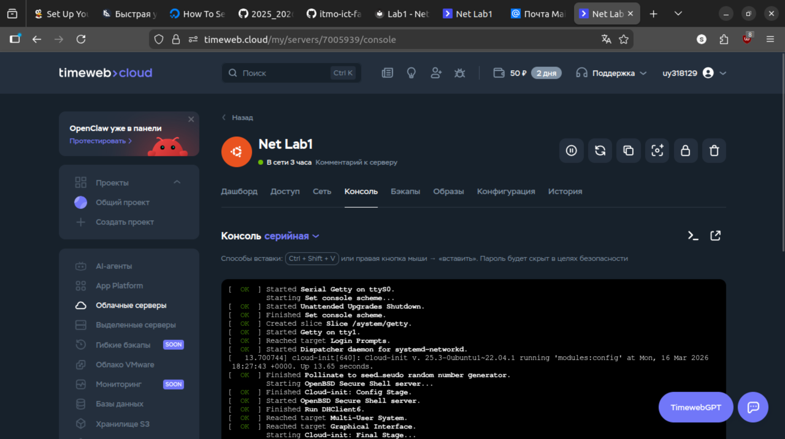

На CHR теперь требуется поменять ip-адреса у пира и  фаерволе:

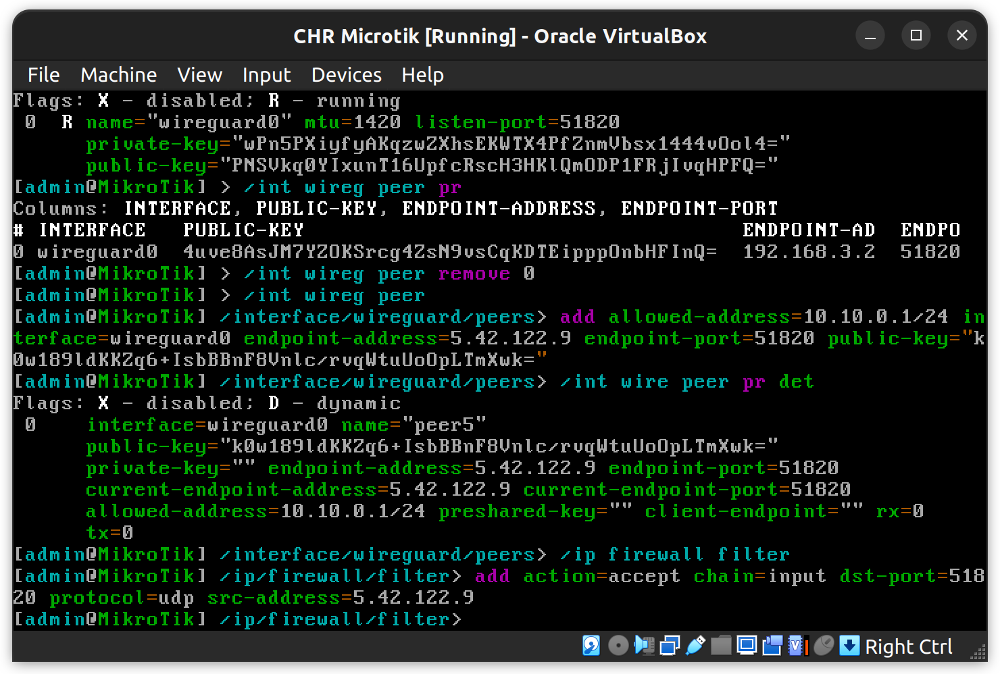

На облачном сервере нужно дописать пуличный ключ пира и поднять туннель:

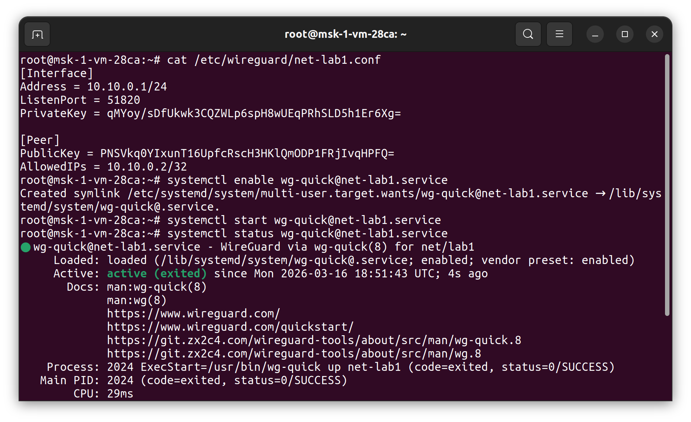

Теперь проверка связности между облачным сервером и локальнм CHR:

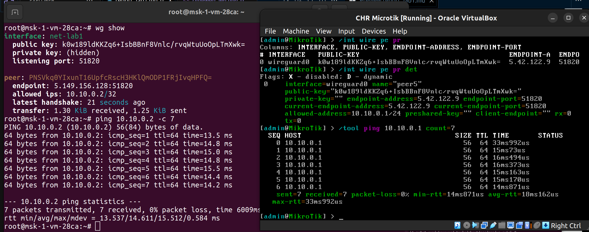

Все работает!

### Заключение

В ходе работы был установлен CHR на виртуальную машину в VirtualBox, затем настроен локальный VPN-сервер, к которому через туннель подключили CHR. Затем от локального сервера перешли к облачному. Туннель создается, ip-связность присутствует. Цель работы достигнута.

Материалы, использованные в работе:

1. [Установка CHR в VirtualBox](https://help.mikrotik.com/docs/spaces/ROS/pages/262864931/CHR+installing+on+VirtualBox)

2. [Работа с WireGuard в CHR](https://help.mikrotik.com/docs/spaces/ROS/pages/69664792/WireGuard)

3. [Работа с WireGuard на Ubuntu](https://www.linuxbabe.com/ubuntu/wireguard-vpn-server-ubuntu)