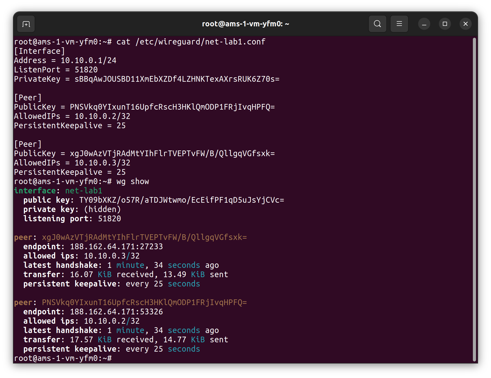
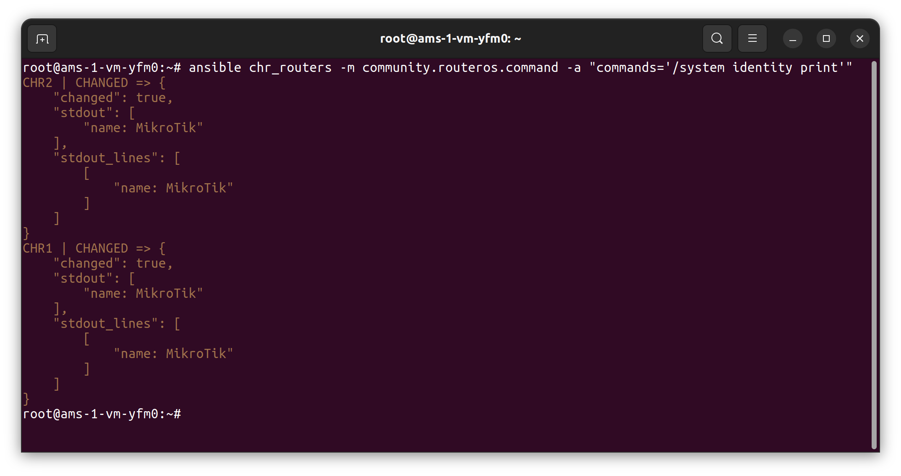
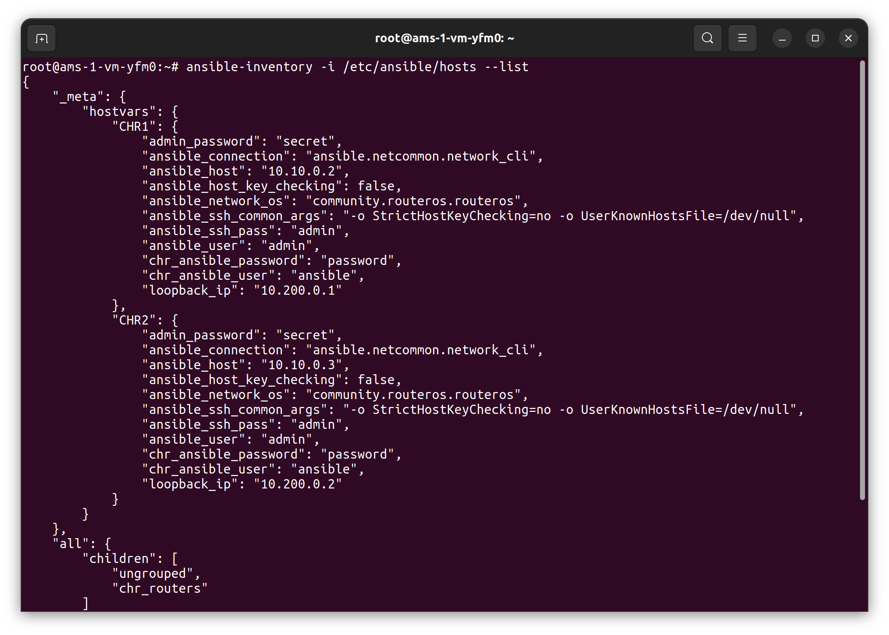
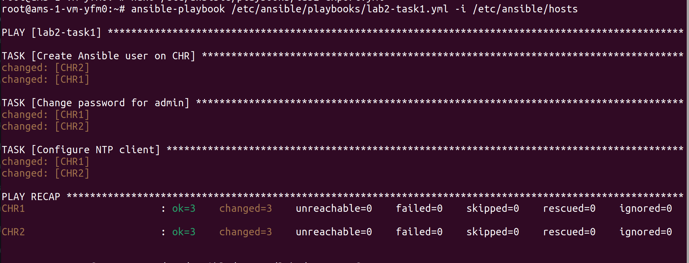
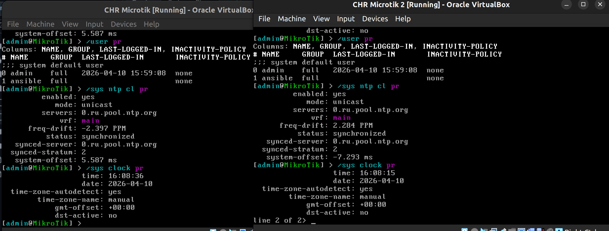
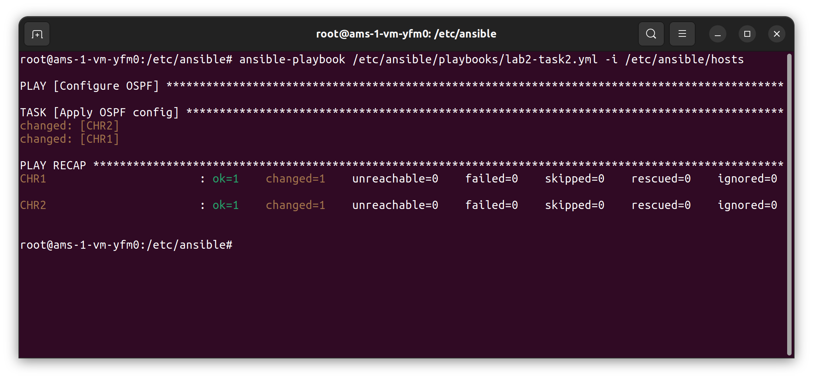
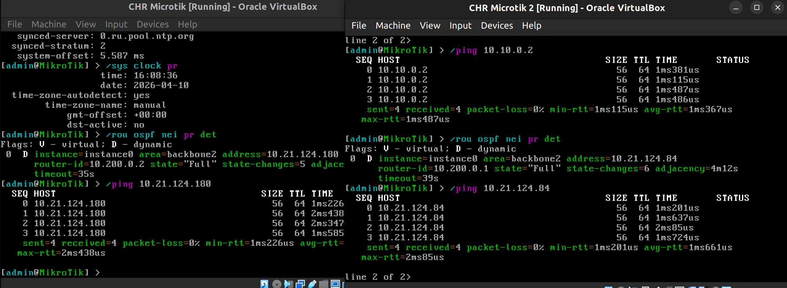
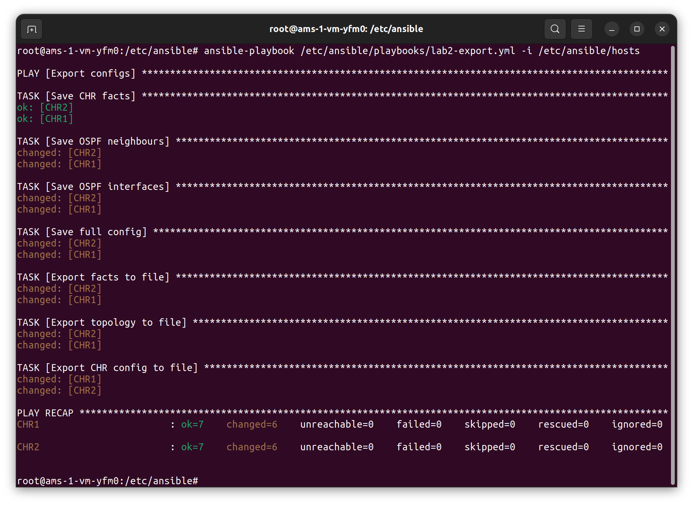
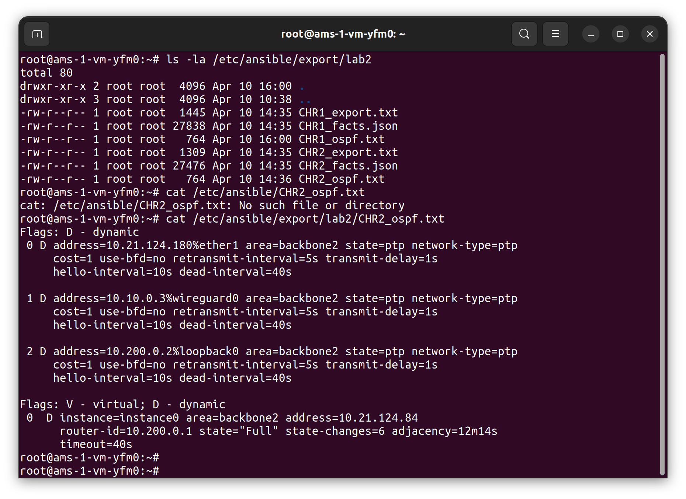

University: [ITMO University](https://itmo.ru/ru/)<br />
Faculty: [FICT](https://fict.itmo.ru)<br />
Course: [Network programming](https://github.com/itmo-ict-faculty/network-programming)<br /> 
Year: 2025/2026<br />
Group: K3321<br />
Author: Stafeev Ivan Alekseevich<br />
Lab: Lab1<br />
Date of create: 09.04.2026<br />
Date of finished: 10.04.2026<br />


# Лабораторная работа №2. Развертывание дополнительного CHR, первый сценарий Ansible

**Цель работы**: с помощью Ansible настроить несколько сетевых устройств и собрать информацию о них. Правильно собрать файл Inventory.

**Ход работы**: 1) установить второй CHR на своем ПК; 2) организовать второй OVPN Client на втором CHR; 3) используя Ansible, настроить сразу на 2-х CHR: логин/пароль; NTP Client; OSPF с указанием Router ID; 4) Собрать данные по OSPF топологии и полный конфиг устройства.


### 1. Установка и настройка втрого CHR

По анлогии с [лабораторной работой №1](../lab1/report_lab1.md) была установлена вторая ВМ с CHR, где проведены такие же настройки Wireguard, как и в первой ЛР. После на сервере в конфиг был добавлен второй пир, и туннель создался успешно.



Из дополнитеьных действия на обоих CHR, без которых дальнейшая работа будет невозможна - это включение SSH через следующие команды:

```
/ip service enable ssh
/ip service set ssh address=0.0.0.0/0
```

Теперь все готово к созданию сценариев на Ansible

### 2. Первое подключение к роутерам через сервер с помощью Ansible

Помимо самого ansible, который у меня, кстати, не хотел устанавливаться через `pip`, поэтому я его установил через `apt`, нужно установить коллекции для работы с RouterOS:

```
ansible-galaxy collection install community.routeros
```

Первым делом был создан `/etc/ansible/ansible.cfg`, в котором важно указать нужные параметры для SSH. С подключением по SSH к роутерам у меня в целом были самые большие проблемы в этой работе поналачу. Указываем тип SSH `paramiko`

```
[defaults]
inventory=/etc/ansible/hosts

[ssh_connection]
ssh_type = paramiko
pipelining = True
```

Потом был создан файл с хостами `/etc/ansible/hosts`:

```
[chr_routers]
CHR1 ansible_host=10.10.0.2
CHR2 ansible_host=10.10.0.3

[chr_routers:vars]
ansible_user=admin
ansible_ssh_pass=admin
ansible_connection=ansible.netcommon.network_cli
ansible_network_os=community.routeros.routeros
ansible_host_key_checking=False
ansible_ssh_common_args='-o StrictHostKeyChecking=no -o UserKnownHostsFile=/dev/null'
```

Здесь создается группа роутеров `chr_routers`, у каждого указывается его адрес. Затем идут переменныеЮ общие для всех устройств в этой группе: логин и пароль админского аккаунта, тип подключения (к CLI через SSH), плюс дополнительные настройки SSH.

Для работы с переменными были созданы дополнительные файлы. Файл с общими переменными `/etc/ansible/group_vars.all.yml`. Тут указываются огин и пароль от аккауна, который будет создаваться сценарием ansible, а также новый пароль от админского аккаунта.

```
chr_ansible_user: "ansible"
chr_ansible_password: "password"
admin_password: "secret"
```

Также были созданы отдельные файлы с переменными для роутеров. Там указывались адреса loopback-интерфейсов для дальнейшей настройки OSPF.

```
# /etc/ansible/host_vars/CHR1.yml
loopback_ip: 10.200.0.1
```

```
# /etc/ansible/host_vars/CHR2.yml
loopback_ip: 10.200.0.2
```

Большой плюс использования переменных, очевидно, состоит в том, что я могу в одном месте поменять нужные мне данные о роутерах, и в сценариях это трогать не надо будет, так как в сценарии значения переменных подставляюстя автоматически с помощью jinja2.

На этом поготовка ansible завершена, можно проверить, что роутеры доступны из сервера:

```
ansible chr_routers -m community.routeros.command -a "commands='/system identity print'"
```



Вот еще вывод inventory:



Все работает.


### 3. Создание сценариев

#### 3.1 Сценарий для создания пользователя и для настройки NTP-клиента

Все сценарии создаются в директории `/etc/ansible/playbooks`

Сценарий для создания нового пользователя, изменения пароля админа и настройки NTP-клиента показан ниже.

```yml
- name: lab2-task1
  hosts: chr_routers
  gather_facts: no
  tasks:
    - name: Create Ansible user on CHR
      community.routeros.command:
        commands:
          - /user add name="{{ chr_ansible_user }}" password="{{ chr_ansible_password }}" group=full
      ignore_errors: yes

    - name: Change password for admin
      community.routeros.command:
        commands:
          - /user set admin password="{{ admin_password }}"

    - name: Configure NTP client
      community.routeros.command:
        commands:
          - /system ntp client set enabled=yes servers=0.ru.pool.ntp.org
```

Пояснения. В `hosts` мы указываем группу устройств, на которую будет распространен сценарий. `gather_facts: no` говорит ansible не собирать лишнюю информацию с устройств, это будет только замедлять общее выполнение и нам не нужно сейчас. В тасках в сценарии везде указывается коллекция `community.routeros.command`, на основе которой будут выполняться команды RouterOS. Собственно сами команды все крайне простые и дополнительных комментариев не требуют. Здесь видно использование переменных через jinga2. 

Запуск сценария с помощью `ansible-playbook` выполнился успешно.



И на роутерах изменеия действительно произошли:




#### 3.2 Сценарий для настройки OSPF

Сам сценарий ниже.

```yml
- name: Configure OSPF
  hosts: chr_routers
  gather_facts: no
  tasks:
    - name: Apply OSPF config
      community.routeros.command:
        commands:
          - /interface bridge add name=loopback0
          - /ip address add address="{{ loopback_ip }}/32" interface=loopback0
          - /routing ospf instance add name=instance0  router-id="{{ loopback_ip }}"
          - /routing ospf area add name=backbone2 area-id=0.0.0.0 instance=instance0
          - /routing ospf interface-template add interfaces=wireguard0,loopback0,ether1 area=backbone2 type=ptp
```

Из интересного здесь разве что постановка значения переменной `{{ loopback_ip }}`. Ее мы вносили не в переменные, относящиеся к группе, а в отдельные переменные роутеров, благодаря чему ждя каждого роутера посставилось свое значения loopback-интерфейса

Сценарий выполнился успешно:




И видно на роутерах, что OSPF настрен корректно:



#### 3.3 Сценарий для экспорта конфигов роутеров

Сам сценарий ниже:

```yml
- name: Export configs
  hosts: chr_routers
  gather_facts: no
  tasks:
    - name: Save CHR facts
      community.routeros.facts:
        gather_subset: all
      register: chr_facts

    - name: Save OSPF neighbours
      community.routeros.command:
        commands:
          - /routing ospf neighbor print detail
      register: chr_ospf_neighbors

    - name: Save OSPF interfaces
      community.routeros.command:
        commands:
          - /routing ospf interface print detail
      register: chr_ospf_interfaces

    - name: Save full config
      community.routeros.command:
        commands:
          - /export
      register: chr_export

    - name: Export facts to file
      ansible.builtin.copy:
        content: "{{ chr_facts.ansible_facts | to_nice_json }}"
        dest: "/etc/ansible/export/lab2/{{ inventory_hostname }}_facts.json"

    - name: Export topology to file
      ansible.builtin.copy:
        content: "{{ chr_ospf_interfaces.stdout[0] }}\n\n{{ chr_ospf_neighbors.stdout[0] }}"
        dest: "/etc/ansible/export/lab2/{{ inventory_hostname }}_ospf.txt"

    - name: Export CHR config to file
      ansible.builtin.copy:
        content: "{{ chr_export.stdout[0] }}"
        dest: "/etc/ansible/export/lab2/{{ inventory_hostname }}_export.txt"
```

Здесь из важного: в первой таске собираем факты о роутерах `community.routeros.facts: gather_subset: all` и сохраняем через `register` (все сохранения далее через него). Для сохранения в файл используется коллекция `ansible.builtin`, а именно `copy`.

Сценарий выполнен успешно:



Видно, что файлы записались, и в них есть выводы из роутеров:




### Заключение

В ходе работы был создан второй роутер CHR, на котором по аналогии с первым были выполнены все настройки, включая Wireguard. Затем была проведена первичная настройка Ansible с созданием файлов хостов, переменных и остального. После были написаны сценарии для 1) добавления нового пользователя и изменения пароля у админского аккаунта; 2) настройки NTP-клиента; 3) настройки OSPF на роутерах; 4) экспорта настроек роутеров в файлы на сервере. Цель работы достигнута.