University: [ITMO University](https://itmo.ru/ru/)<br />
Faculty: [FICT](https://fict.itmo.ru)<br />
Course: [Network programming](https://github.com/itmo-ict-faculty/network-programming)<br /> 
Year: 2025/2026<br />
Group: K3321<br />
Author: Stafeev Ivan Alekseevich<br />
Lab: Lab1<br />
Date of create: 17.04.2026<br />
Date of finished: 20.04.2026<br />


# Лабораторная работа №3. Развертывание Netbox, сеть связи как источник правды в системе технического учета Netbox

**Цель работы**: с помощью Ansible и Netbox собрать всю возможную информацию об устройствах и сохранить их в отдельном файле.

**Ход работы**: 1) Поднять Netbox на дополнительной VM; 2) Заполнить всю возможную информацию о ваших CHR в Netboxж 3) Используя Ansible и роли для Netbox в тестовом режиме сохранить все данные из Netbox в отдельный файл, результат приложить в отчётж 4) Написать сценарий, при котором на основе данных из Netbox можно настроить 2 CHR, изменить имя устройства, добавить IP адрес на устройствож 5) Написать сценарий, позволяющий собрать серийный номер устройства и вносящий серийный номер в Netbox.

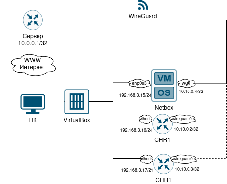

### Часть 1. Установка Netbox

Для установки Netbox была создана еще одна, уже третья, виртуальная машина с `ubuntu-22.04.5-live-server`. Был выбран путь установки Netbox через Docker ([репозиторий](https://github.com/netbox-community/netbox-docker)). Для этого потребовались следующие команды:

```bash
sudo apt install -y git curl openssl jq
curl -fsSL https://get.docker.com -o get-docker.sh
sudo sh get-docker.sh
sudo systemctl enable --now docker
```

Установка Docker'а прошла успешно:

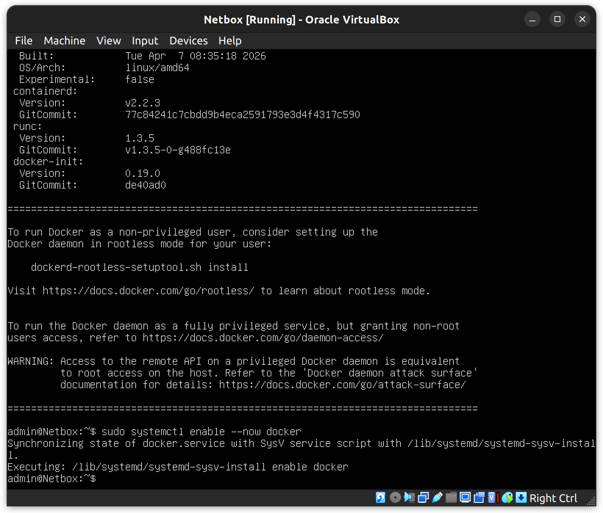

Для непосредственно установки Netbox выполним следующие команды:

```bash
git clone -b release https://github.com/netbox-community/netbox-docker.git
cd netbox-docker
cp docker-compose.override.yml.example docker-compose.override.yml
docker compose pull
docker compose up
```

Как можно видеть (`docker compose ps`) контейнеры все в состоянии Up. То, что один из них unhealthy, нас пока не интересует.

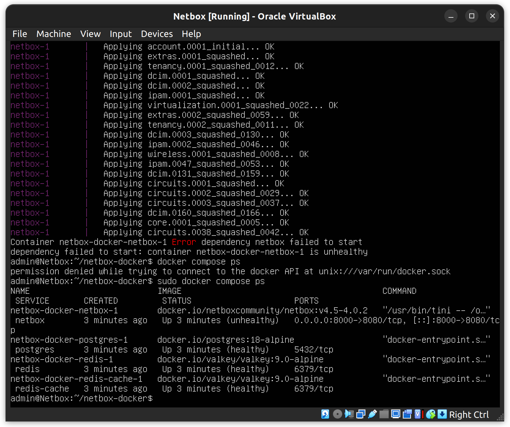

Чтобы зайти в панель управления Netbox на хосте, нужно: 1) в настройках сети у ВМ поставить Bridge Adapter, как было с CHR; 2) в файле `docker-compose.override.yml` написать данные от админского аккаунта в полях `SUPERUSER_NAME` и `SUPERUSER_PASSWORD`. После пересборки контейнеров в панель получается зайти по адресу `https://<IP-адрес ВМ>:8000/login/`:

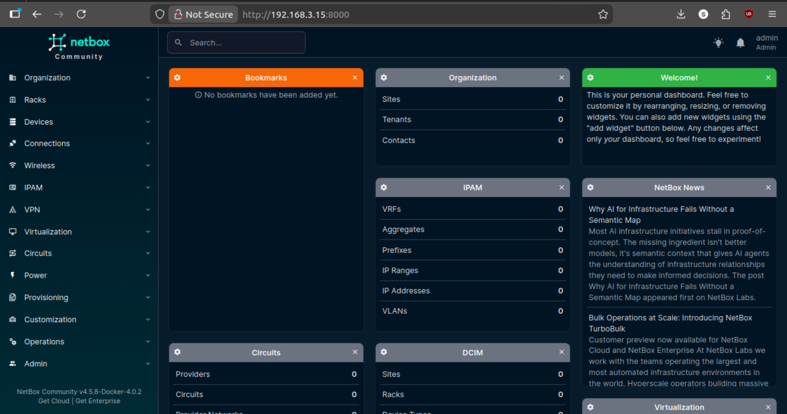

### Часть 2. Настройка Netbox

Перед тем, как добавит устройства, нужно создать несколько объектов в общей иерархии Netbox. Делаем `Site` NetProg-lab3, `Device Roles` Router, `Manufacturers` Microtik, `Platforms` RouterOS-v7, `Device Types` CHR (с указанием Manufacturer). Потом уже создаются два CHR, в атрибутах которых устанавливаем то, что создали ранее. Итого имеем два девайса, но пока не подходящих для работы с Ansible.

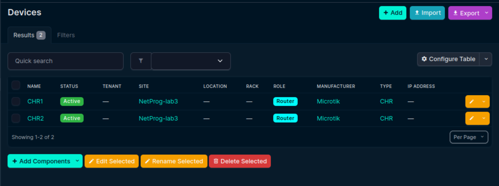

Теперь для каждого из устройств нужно добавить:

- Интерфейсы: `ether1`, `loopback0`, `wireguar0` (такие же, какие были на CHR) с указанием типа `Bridge` или `Virtual`

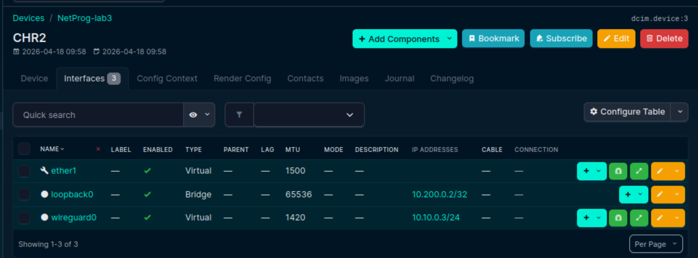

- IP-адреса: `10.10.0.N` для Wireguard'а и `10.200.0.K` для OSPF (вкладка `IPAM`). Адреса привязываюся к нужным CHR

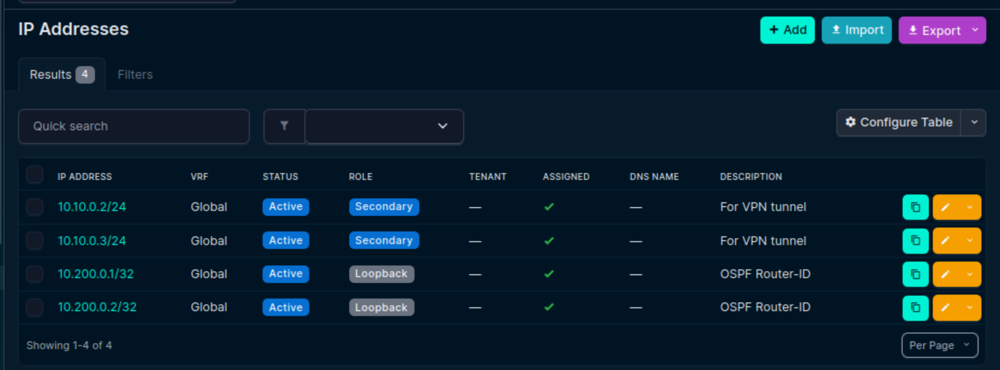

- `Applications Services`: SSH и Wireguard (делал их без темплейта, просто с указанием нужных данных - порта, протокола и т.п.)

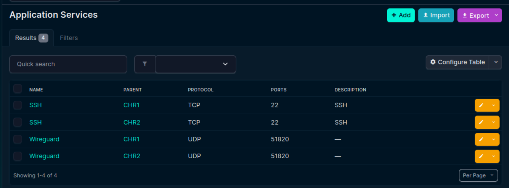

- `Config Context`. То, что не получилось засунуть в Netbox через доступные поля, было решено засунуть в `Config Context` каждого роутера. Все настройки были взяты из предыдущем лабораторной работы, а именно из экспорта сценарием Ansible, после чего из них был сделан JSON.

```json
{
    "ntp": {
        "enabled": true,
        "servers": [
            "0.ru.pool.ntp.org"
        ]
    },
    "ospf": {
        "instances": [
            {
                "areas": [
                    {
                        "interfaces": [
                            "wireguard0",
                            "loopback0",
                            "ether1"
                        ],
                        "name": "backbone2",
                        "type": "ptp"
                    }
                ],
                "name": "instance0"
            }
        ],
        "router_id": "10.200.0.2"
    },
    "static_routes": [
        {
            "dst": "10.10.0.0/24",
            "gateway": "wireguard0"
        }
    ],
    "wireguard": {
        "listen_port": 51820,
        "mtu": 1420,
        "peers": [
            {
                "allowed_address": "10.10.0.1/24",
                "endpoint": "147.45.156.85:51820",
                "name": "peer7",
                "public_key": "TY09bXKZ/o57R/aTDJWtwmo/EcEifPF1qD5uJsYjCVc="
            }
        ]
    }
}
```

На этом настройка Netbox завершена, можно переходить к работе с Ansible.

### Часть 3. Экспорт из Netbox через Ansible

По аналогии из предыдущем лабораторной работой нужно сделать сценарий для выгрузки, однако сначала нужно решить проблему доступа к Netbox из удаленного сервера. ВМ с Netbox находится в одной сети с ВМ CHR1 и CHR2, но к ней нет туннеля Wireguard, так что доступа к этой ВМ пока нет. Было решено пойти по простому пути и сделать ВПН-туннель между сервером и ВМ с Netbox (совершенно так же, как делалось в [лабораторной работе №1](../lab1/report_lab1.md)). В результате связь между устройствами есть:

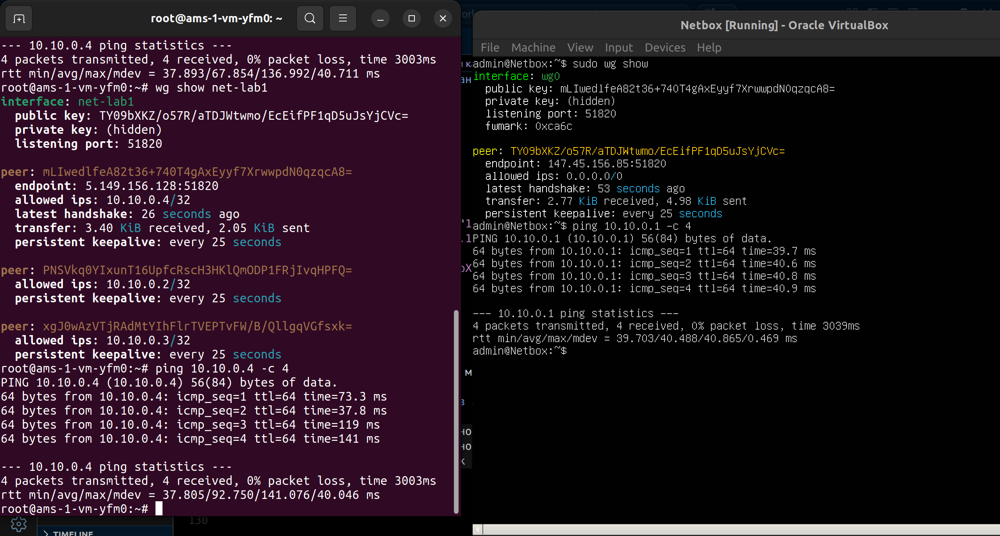

Далее в `/etc/asible/hosts` была доабвлена группа `[netbox]` с соответсвующим устройством, а в переменные устройства (`/etc/ansible/host_vars/Netbox.yml`) добавлен API Token. Послек был написан следующий сценарий:

```yml
- name: Export data from NetBox
  hosts: localhost
  gather_facts: false

  vars:
    netbox_url: "http://{{ hostvars['Netbox'].ansible_host }}:8000"
    api_token: "{{ hostvars['Netbox'].netbox_token }}"
    output_dir: "/etc/ansible/export/lab3"
    output_file: "netbox_export.json"
    target_devices: ["CHR1", "CHR2"]
    device_filter: "name__in={{ target_devices | join(',') }}"

  tasks:
    - name: Collect devices
      set_fact:
        devices_raw: >-
          {{
            lookup(
              'netbox.netbox.nb_lookup',
              'devices',
              api_endpoint=netbox_url,
              token=api_token,
              validate_certs=False,
              api_filter=device_filter
            )
          }}

    - name: Collect interfaces
      set_fact:
        interfaces_raw: >-
          {{
            lookup(
              'netbox.netbox.nb_lookup',
              'interfaces',
              api_endpoint=netbox_url,
              token=api_token,
              validate_certs=False,
              api_filter=device_filter
            )
          }}

    - name: Collect IP addresses
      set_fact:
        ip_raw: >-
          {{
            lookup(
              'netbox.netbox.nb_lookup',
              'ip-addresses',
              api_endpoint=netbox_url,
              token=api_token,
              validate_certs=False,
              api_filter=device_filter
            )
          }}

    - name: Collect services
      set_fact:
        services_raw: >-
          {{
            lookup(
              'netbox.netbox.nb_lookup',
              'services',
              api_endpoint=netbox_url,
              token=api_token,
              validate_certs=False,
              api_filter=device_filter
            )
          }}

    - name: Build JSON
      set_fact:
        netbox_export:
          export_metadata:
            timestamp: "{{ now(utc=True).strftime('%Y-%m-%dT%H:%M:%S') }}"
          devices: "{{ devices_raw | map(attribute='value') | list }}"
          interfaces: "{{ interfaces_raw | map(attribute='value') | list }}"
          ip_addresses: "{{ ip_raw | map(attribute='value') | list }}"
          services: "{{ services_raw | map(attribute='value') | list }}"

    - name: Save JSON to file
      ansible.builtin.copy:
        content: "{{ netbox_export | to_nice_json(indent=2) }}"
        dest: "{{ output_dir }}/{{ output_file }}"
        mode: '0644'
```

Устроен он достаточно просто: в цикле по каждому устройству из `target_devices` собираются все данные о нем при помощи коллекции `netbox` для Ansible (а именно при помощи модуля `nb_lookup`), после чего создается json-файл для сохранения. Здесь есть пара нюансов, с которыми я столкнулся: 1) `hosts: localhost` нужен, чтобы файл экспорта сохранялся на машине с Ansible. Изначально я ставил `hosts: netbox` по аналогии с ЛР№2, однако тут не нужно подключение по SSH к машине с Netbox, так как все делается через API; 2) API-токен. Я потратил несколько часов, чтобы понять, почему запросы через curl к машине с Netbox с указанием токена отрабатывают корректно, а в сценарии возвращается ошибка 403. Дело в том, что у меня было установлено две версии коллекции netbox для Ansible, 3.16 и 3.22. По-видимому, в версии 3.22 был баг, из-за которого токен не передавался в nb_lookup через pynetbox. Когда я удалил версию 3.22, все заработало. 

Итого: сценарий отрабаывает корректно

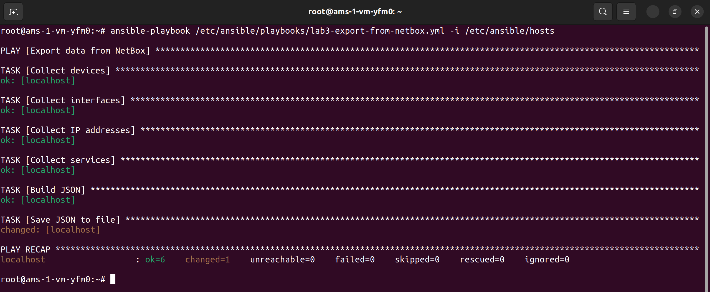

Полный файл экспорта можно найти [здесь](./ansible_files/netbox-export.json). Вот для примера кусочек оттуда:

```json
"display": "CHR2",
"display_url": "http://10.10.0.4:8000/dcim/devices/3/",
"face": null,
"front_port_count": 0,
"id": 3,
"interface_count": 3,
"inventory_item_count": 0,
"last_updated": "2026-04-18T09:58:44.883311Z",
"latitude": null,
"local_context_data": {
"ntp": {
    "enabled": true,
    "servers": [
    "0.ru.pool.ntp.org"
    ]
},
"ospf": {
    "instances": [
    {
        "areas": [
        {
            "interfaces": [
            "wireguard0",
            "loopback0",
            "ether1"
            ],
            "name": "backbone2",
            "type": "ptp"
        }
        ],
        "name": "instance0"
    }
    ],
    "router_id": "10.200.0.2"
},
"static_routes": [
    {
    "dst": "10.10.0.0/24",
    "gateway": "wireguard0"
    }
],
"wireguard": {
    "listen_port": 51820,
    "mtu": 1420,
    "peers": [
    {
        "allowed_address": "10.10.0.1/24",
        "endpoint": "147.45.156.85:51820",
        "name": "peer7",
        "public_key": "TY09bXKZ/o57R/aTDJWtwmo/EcEifPF1qD5uJsYjCVc="
    }
    ]
}
},
```

На сервере все тоже сохранилось:

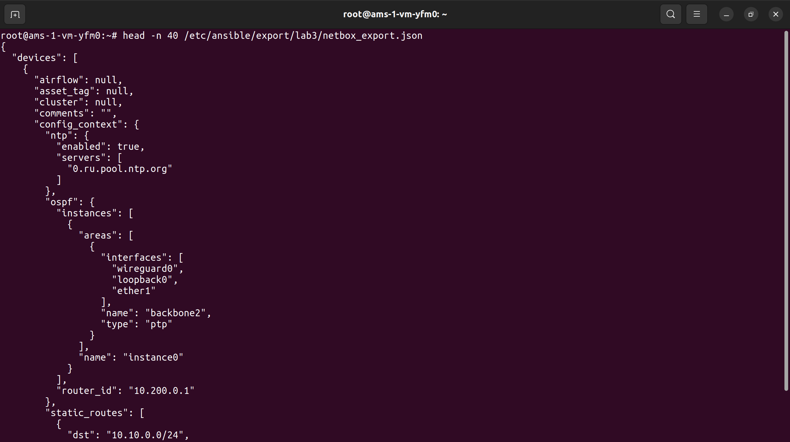

### Часть 4. Настройка CHR на основе данных из Netbox

Для чистоты эксперименты были созданы еще две пустые ВМ с CHR. Сразу важно заметить: настройка CHR включает в себя настройку Wireguard, то есьт по умолчанию с сервера не будут доступны роутеры. Как это решить? Ведь не хочется руками делаь частичную настройку. Ответ есть: у нас всегда в сети есть ВМ с Netbox, которая доступна через ВПН, но она же находится в одной подсети с остальными ВМ, так как у всех них выбран `Bridge Adapter`. С помощью `nmap` найдем ip-адреса этих устройств:

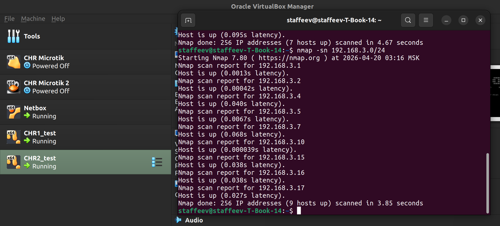

Получилось `192.168.3.16` и `192.168.3.17` (у ВМ с Netbox `192.168.3.15`). Видим, что никаких настроек на этих CHR нет:

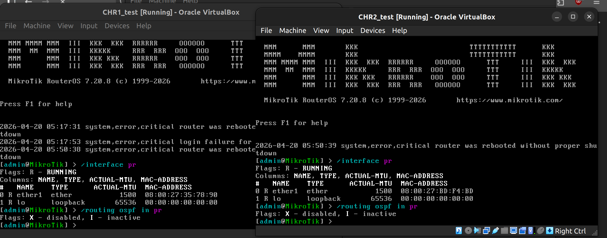

Тут я столкнулся с проблемой, что на ВМ с Netbox нет установленного SSH-server, и установиь его не получается, так как выхода в интернет на Вм нет... Я мучился несколько часов, в итоге решением стала просто команда, немного уменьшающая MTU на интерфейсе: `sudo ip link set enp0s3 mtu 1400`. Почему нужно было сделаь именно ЭТО, я без понятия. На CHR доступ в интернет был сразу.

Теперь, когда доступ к ВМ Netbox точно есть, нужно сделать пару новых настроек в Ansible на сервере. У Ansible есть возможность подключться к стройствам через промежуточный узел - в нашем случае это ВМ с Netbox, к которой есть доступ через ВПН. Поменяем файл с хостами:

```
[chr_routers]
CHR1 ansible_host=192.168.3.16
CHR2 ansible_host=192.168.3.17

[netbox]
Netbox ansible_host=10.10.0.4

[chr_routers:vars]
ansible_user=admin
ansible_password=admin
ansible_connection=ansible.netcommon.network_cli
ansible_network_os=community.routeros.routeros
ansible_ssh_common_args='-o ProxyCommand="sshpass -p admin ssh -vvv -W %h:%p admin@10.10.0.4" -o PubkeyAuthentication=no -o PreferredAuthentications=password -o PasswordAuthentication=yes -o ControlMaster=auto -o ControlPersist=60s -o UserKnownHostsFile=/dev/null -o StrictHostKeyChecking=no'
```

Зададим у ВМ CHR адреса в подсети хоста, и, главное, поменяем аргументы подключения к SSH. Когда я пробовал разные способы подключиться (через `ProxyJump`, `ProxyCommand="ssh ..."` с указанием или не указанием `ansible_ssh_pass` и другими вариантами), ничего не срабатывало. Для простоты логин и пароль от аккаунтов для трех ВМ сейчас одинаковый, но подключение к `192.168.3.N` не шло при успешном подключении к `10.10.0.4`. При этом явное указание хопа, например, так `ssh -J admin@10.10.0.4 admin@192.168.3.16` позволяло подключиться к ВМ CHR. Дело в том, что у Ansible схема подключения по ssh немного отличается от обычного вызова ssh: внутри используется sshpass и доступ только по паролю (а не по ключам), поэтому благодаря [этому ответу со StackOverflow](https://stackoverflow.com/questions/69042080/ansible-failed-msg-invalid-incorrect-password) было найдено рабочее решение с `ProxyCommand="sshpass...`

Далее непосредственно настройка роутеров. После прошлого пункта у нас есть JSON-конфигурации в файле `/etc/ansible/export/lab3/netbox_export.json`. По данным из него я сделал шаблон для jinja2, в котором нет захардкоденных настроек, все создается чисто по данным JSON'а (каюсь, нейросети помошли собраьт шааблон, так как самому переделвать структуру из 1000 строк в другую структуру было бы крайне долго). Вот шаблон `/etc/asible/templates/chr.conf.j2`:

```jinja2


### NAME ###

/system identity set name={{ dev.name }}

### INTERFACES ###




/interface bridge
add name={{ iface.name }}


/interface wireguard
add name={{ iface.name }} listen-port={{ dev.config_context.wireguard.listen_port }} mtu={{ dev.config_context.wireguard.mtu }}


/interface ethernet
set [find name={{ iface.name }}] disable-running-check=no





### WIREGUARD PEERS ###




/interface wireguard peers

add interface={{ wg_iface.name }} name={{ peer.name }} public-key="{{ peer.public_key }}" endpoint-address={{ peer.endpoint.split(':')[0] }} endpoint-port={{ peer.endpoint.split(':')[1] }} allowed-address={{ peer.allowed_address }}




### IP ADDRESSES ###

/ip address

add address={{ ip.address }} interface={{ ip.assigned_object.name }}



### STATIC ROUTES ### 


/ip route

add dst-address={{ r.dst }} gateway={{ r.gateway }}




### OSPF ###



/routing ospf instance

add name={{ inst.name }} router-id={{ ospf.router_id }}


/routing ospf area


add name={{ area.name }} instance={{ inst.name }}



/routing ospf interface-template


add area={{ area.name }} interfaces={{ area.interfaces | join(",") }} type={{ area.type }}




### NTP ###

/system ntp client set enabled=yes servers={{ dev.config_context.ntp.servers | join(",") }}
```

В нем создаются все объекты, которые настраивались в первой и второй лабораторных (интерфейсы, Wireguard, OSPF и т.д.). Осталось только написать сценарий `/etc/ansible/playbooks/lab3-configure-chr.yml`:

```yml
- name: Configure CHR from Netbox
  hosts: chr_routers
  gather_facts: no
  vars_files:
    - /etc/ansible/export/lab3/netbox_export.json
  vars:
    jump_host: 10.10.0.4
  tasks:

    - name: Render config locally
      template:
        src: /etc/ansible/templates/chr.conf.j2
        dest: "/tmp/{{ inventory_hostname }}.rsc"
      delegate_to: localhost

    - name: Upload config to CHR via Netbox
      ansible.builtin.shell: |
        sshpass -p {{ ansible_password }} scp \
        -o StrictHostKeyChecking=no \
        -o ProxyCommand="sshpass -p {{ ansible_password }} ssh -o StrictHostKeyChecking=no -W %h:%p {{ ansible_user }}@{{ jump_host }}" \
        /tmp/{{ inventory_hostname }}.rsc \
        {{ ansible_user }}@{{ ansible_host }}:/{{ inventory_hostname }}.rsc

    - name: Apply config on CHR
      community.routeros.command:
        commands:
          - /import file-name={{ inventory_hostname }}.rsc
```

Здесь все просто: вызывается рендер шаблона jinja2 на основе файла экспорта, потом файл отправляеся на CHR при помощи `sshpass scp`, последним шагом настройки импортируются из загруженного файла. Выполнение сценаия прошло успешно:

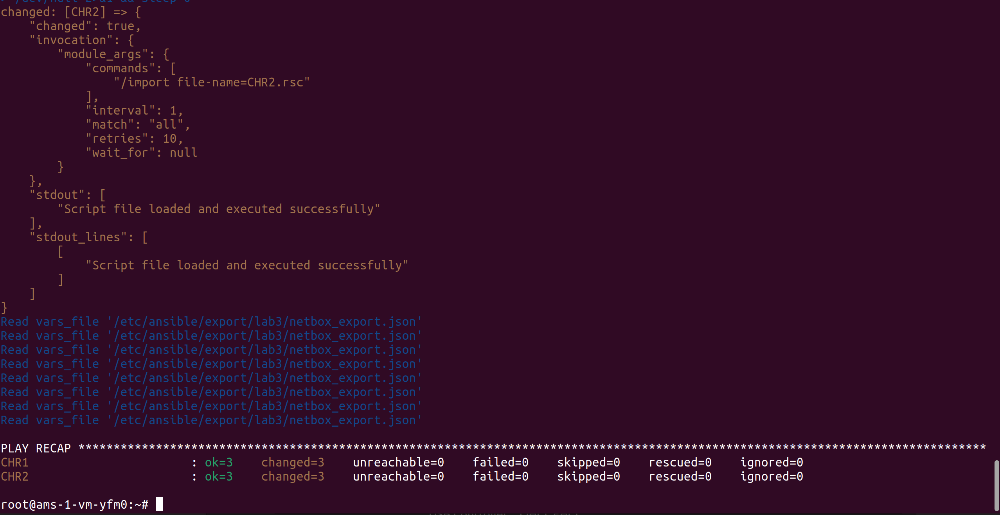

Новые роутеры оказалиь настроены:

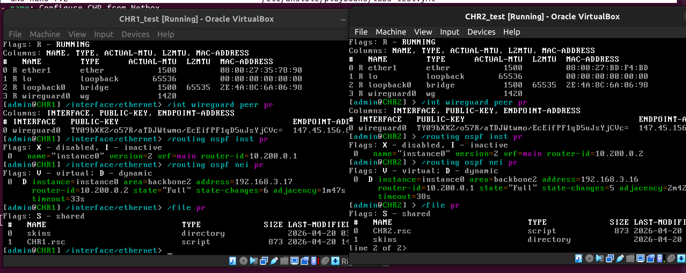


После ручного внесения публичных ключей у новых CHR в конфиг Wireguard на сервере связь по ВПН между сервером и новыми CHR установилась:

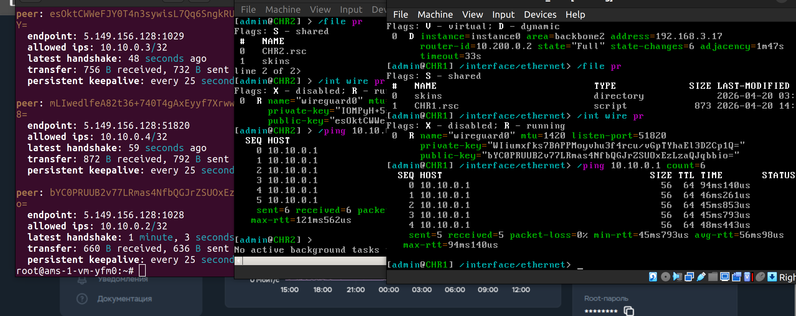

### Часть 5. Получение серийного номера CHR

В Netbox в описании устройства ест отдельное поле `Serial Number`, которое нам и нужно заполнить. Так как у нас виртуальные CHR, серийного номера как такового у них нет (который доступен через `/system routerboard`), но есть `system-id` в лицензии, который уникальный для каждого инстанса. Его мы и возьмем за серийный номер.

Сейчас поле с серийным номером на Netbox пустое:

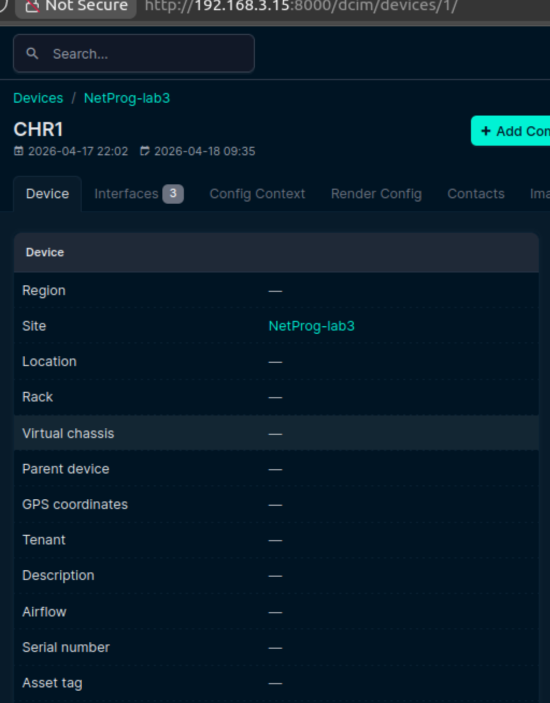

Сценарий для получения серийного номера с CHR и загрузки его на Netbox получился следующим:

```yml
- name: Collect CHR serial number and upload to Netbox
  hosts: chr_routers
  gather_facts: no
  vars:
    netbox_url: "http://{{ hostvars['Netbox'].ansible_host }}:8000"
    netbox_token: "{{ hostvars['Netbox'].netbox_token }}"

  tasks:
    - name: Get license info
      community.routeros.command:
        commands:
          - /system license print
      register: license_info

    - name: Extract system-id
      set_fact:
        serial_number: >-
          {{ license_info.stdout[0]
           | regex_search('system-id: ([^\s]+)', '\1')
           | first }}

    - name: Show serial
      debug:
        msg: "Serial for {{ inventory_hostname }} = {{ serial_number }}"

    - name: Get device from NetBox
      uri:
        url: "{{ netbox_url }}/api/dcim/devices/?name={{ inventory_hostname }}"
        method: GET
        headers:
          Authorization: "Token {{ netbox_token }}"
          Content-Type: "application/json"
      register: device_data

    - name: Update serial in NetBox
      uri:
        url: "{{ netbox_url }}/api/dcim/devices/{{ device_data.json.results[0].id }}/"
        method: PATCH
        headers:
          Authorization: "Token {{ netbox_token }}"
          Content-Type: "application/json"
        body_format: json
        body:
          serial: "{{ serial_number | string }}"
      when: device_data.json.count > 0
```

Рабоатет он так: с CHR берется вывод команды `/system license print`, из него извлекается `system-id`. Потом из Netbox по имени ansible_host находится устройство, по id которого в последней таске добавляется через API полученный серийный номер.

Выполнение сценария поршло успешно:

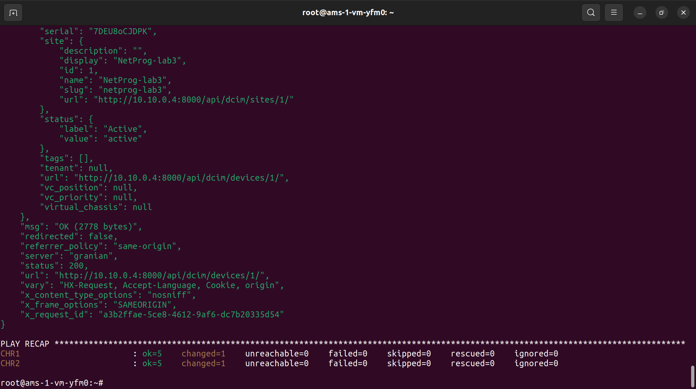

Проверим на Netbox - серийные номера действительно появились!

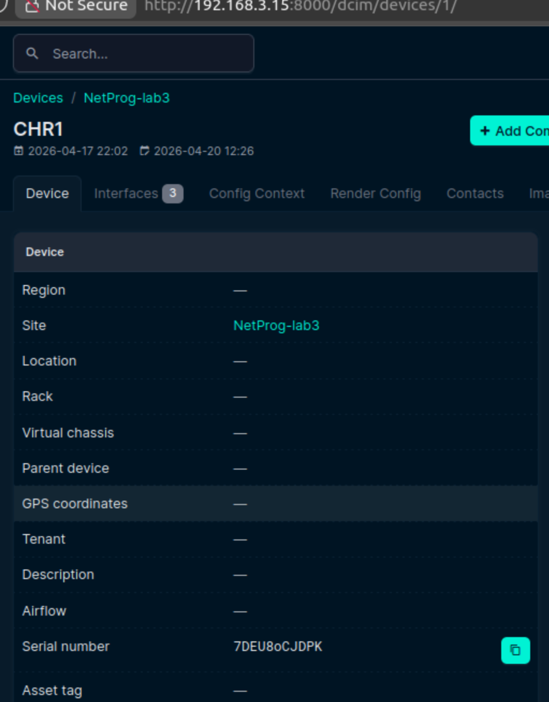

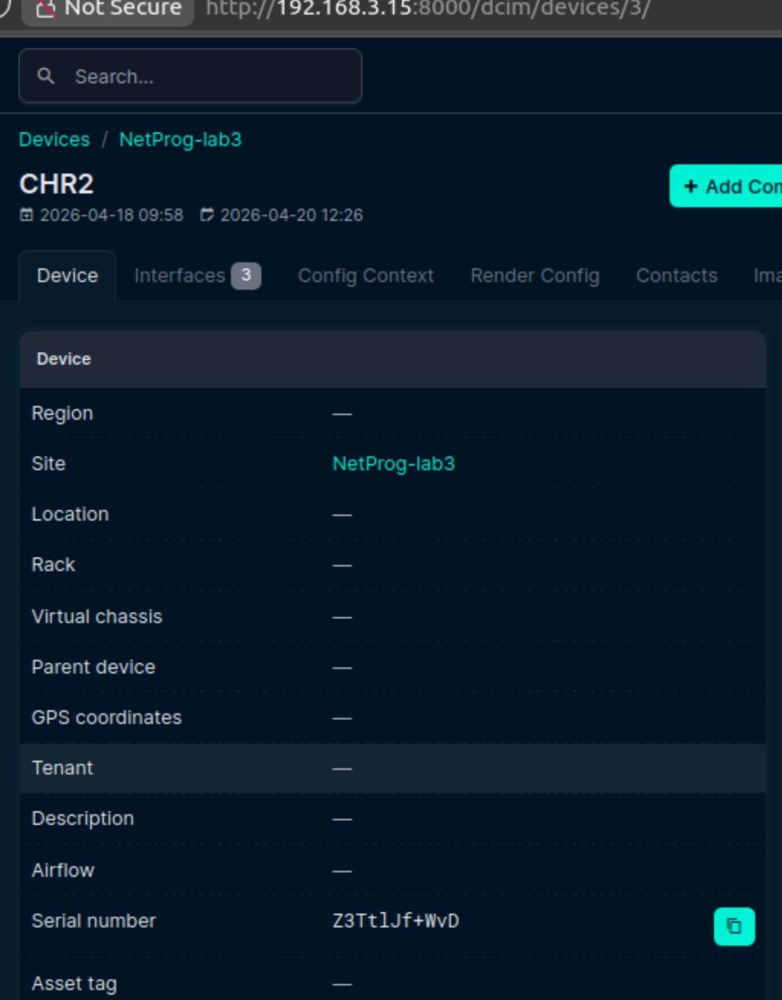

### Заключение

В ходе работы была создана ВМ, на которой был настроен Netbox. В Netbox были внесены данные о CHR1 и CHR2 с предыдущих двух лабораторных работ. После через сценарий Ansible данные были эспортированы в один JSON-файл, на основе которого был создан шаблон для jinja2, позволяющий провести точно такие же настройки CHR на новых устройствах. Настройка двух новых CHR прошло успешно, все настройки подтянулись корректно, и после ручного внесения публичных ключей Wireguard доступ с сервера на CHR вновь появился. Настройка CHR осуществлялась при помощи промежуточного узла - ВМ с Netbox - который считается всегда доступным нам по ВПН и который находится в одной подсети с ВМ с CHR. В конце с новых CHR был получен серийный номер, добавленный в описание девайсов в Netbox через API. Цель работы достигнута.