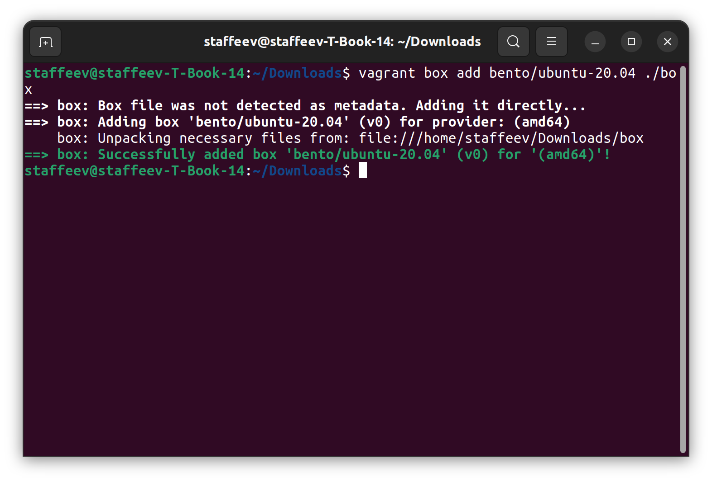
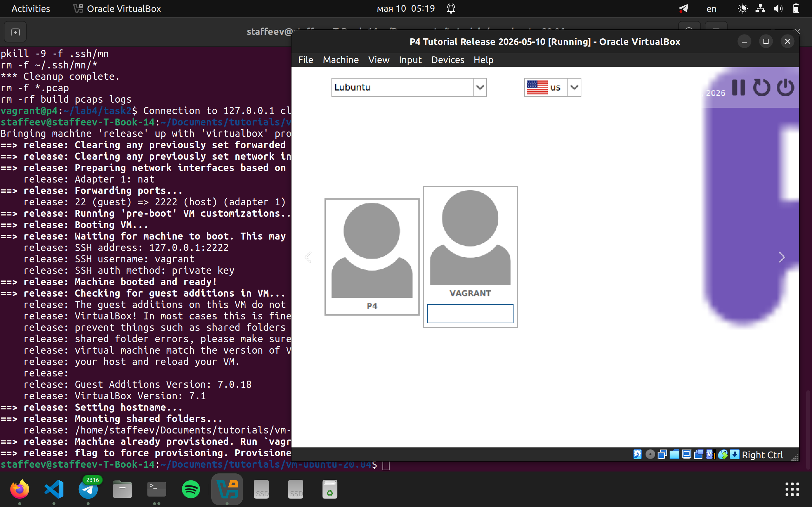
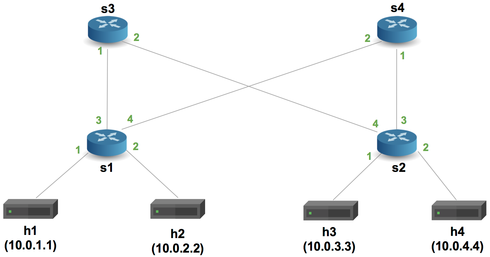
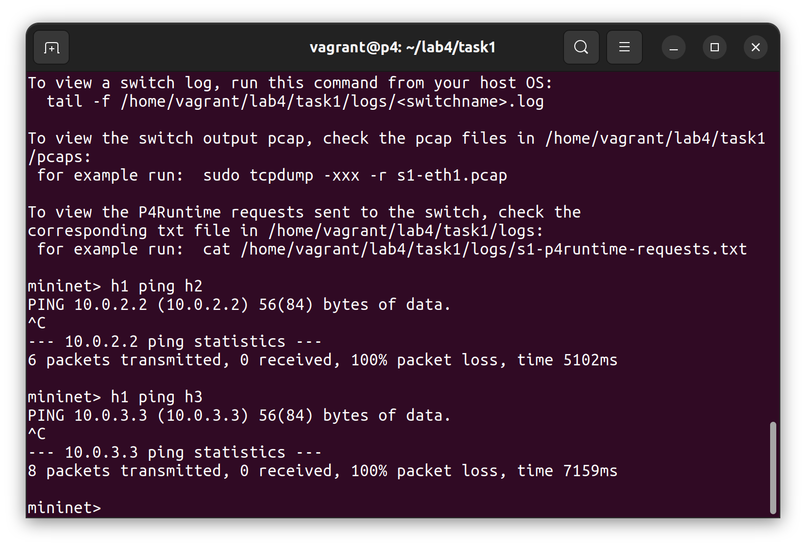
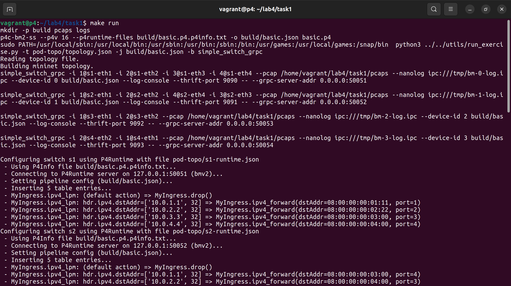
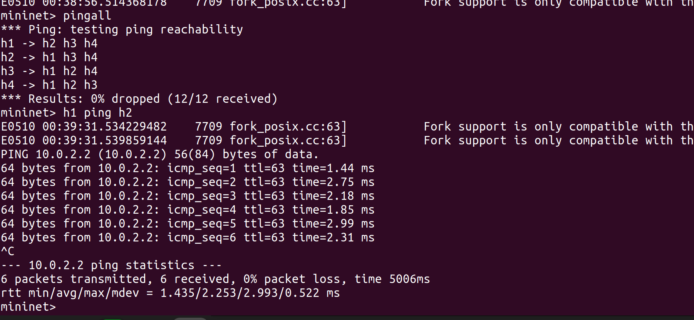
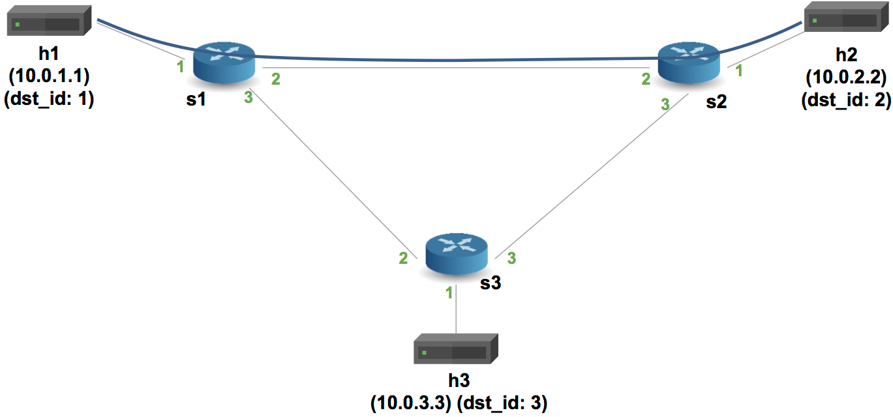
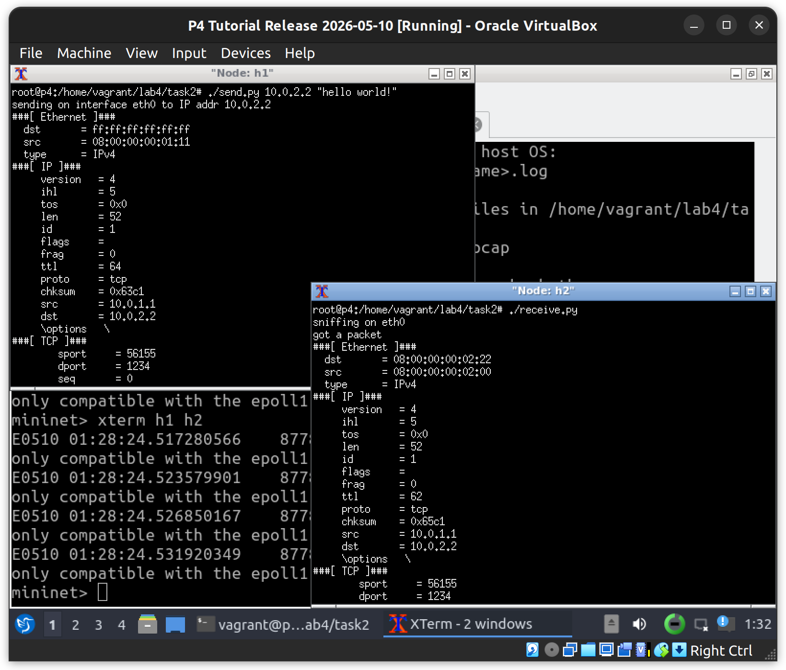
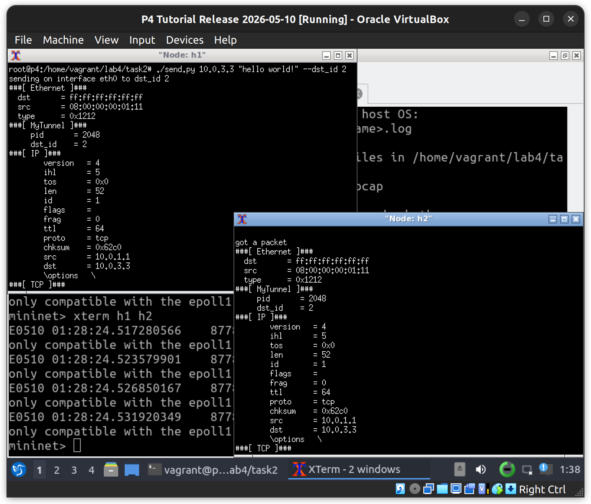

University: [ITMO University](https://itmo.ru/ru/)<br />
Faculty: [FICT](https://fict.itmo.ru)<br />
Course: [Network programming](https://github.com/itmo-ict-faculty/network-programming)<br /> 
Year: 2025/2026<br />
Group: K3321<br />
Author: Stafeev Ivan Alekseevich<br />
Lab: Lab4<br />
Date of create: 07.05.2026<br />
Date of finished: 10.05.2026<br />


# Лабораторная работа №4. Базовая 'коммутация' и туннелирование используя язык программирования P4

**Цель работы**: Изучить синтаксис языка программирования P4 и выполнить 2 задания обучающих задания от Open network foundation для ознакомления на практике с P4.

**Ход работы**: 1) склонировать репозиторий p4lang/tutorials; 2) установить Vagrant и VirtualBox; 3) развернуть тестовую среду `vagrant up`; 4) выполнить задание [Implementing Basic Forwarding](https://github.com/p4lang/tutorials/tree/master/exercises/basic); 5) выполнить задание [Implementing Basic Tunneling](https://github.com/p4lang/tutorials/tree/master/exercises/basic_tunnel)


### Часть 0. Установка Vagrant и ВМ с P4

Казалось бы, очень простая задача - установить программу, однако Hashicorp приостановили деятельность в РФ, и установить Vagrant по их туториалу (чеез wget получить файл и установить) не выходило - сайт недоступен даже с ВПН. Установил через `apt intstall vagrant` - в итоге установленная версия не подходит для работы с virtualbox 7.x. Психанул и скачал на телефоне [бинарник](https://releases.hashicorp.com/vagrant/2.4.9/vagrant_2.4.9_linux_amd64.zip) и перекинул себе на ноутбук, после чего установил.

Дальше склонировал репозиторий и на радостях побежал выполнять `vagrant up`, и вдруг..

```bash
staffeev@staffeev-T-Book-14:~/Documents/tutorials/vm-ubuntu-20.04$ vagrant up
Bringing machine 'release' up with 'virtualbox' provider...
==> release: Box 'bento/ubuntu-20.04' could not be found. Attempting to find and install...
    release: Box Provider: virtualbox
    release: Box Version: >= 0
==> release: Loading metadata for box 'bento/ubuntu-20.04'
    release: URL: https://vagrantcloud.com/api/v2/vagrant/bento/ubuntu-20.04
==> release: Adding box 'bento/ubuntu-20.04' (v202407.23.0) for provider: virtualbox (amd64)
    release: Downloading: https://vagrantcloud.com/bento/boxes/ubuntu-20.04/versions/202407.23.0/providers/virtualbox/amd64/vagrant.box
An error occurred while downloading the remote file. The error
message, if any, is reproduced below. Please fix this error and try
again.

The requested URL returned error: 404
staffeev@staffeev-T-Book-14:~/Documents/tutorials/vm-ubuntu-20.04$ 
```

ВМ-то тоже не может скачаться, раз серер недоступен. Пришлось скачивать [ВМ](https://vagrantcloud.com/bento/boxes/ubuntu-20.04) на телефон и перекидывать себе на ноутбук снова (благо весит всего 700мб). Осталось добавить ВМ в Vagrant командой `vagrant box add bento/ubuntu-20.04 ./box`. 



Во время первого поднятия ВМ что-то пошло не так с установкой всех пакетов:

```bash
staffeev@staffeev-T-Book-14:~/Documents/tutorials/vm-ubuntu-20.04$ vagrant reload --provision
==> dev: VM not created. Moving on...
==> release: Attempting graceful shutdown of VM...
==> release: Clearing any previously set forwarded ports...
==> release: Clearing any previously set network interfaces...
==> release: Preparing network interfaces based on configuration...
    release: Adapter 1: nat
==> release: Forwarding ports...
    release: 22 (guest) => 2222 (host) (adapter 1)
==> release: Running 'pre-boot' VM customizations...
==> release: Booting VM...
==> release: Waiting for machine to boot. This may take a few minutes...
    release: SSH address: 127.0.0.1:2222
    release: SSH username: vagrant
    release: SSH auth method: private key
==> release: Machine booted and ready!
==> release: Checking for guest additions in VM...
    release: The guest additions on this VM do not match the installed version of
    release: VirtualBox! In most cases this is fine, but in rare cases it can
    release: prevent things such as shared folders from working properly. If you see
    release: shared folder errors, please make sure the guest additions within the
    release: virtual machine match the version of VirtualBox you have installed on
    release: your host and reload your VM.
    release: 
    release: Guest Additions Version: 7.0.18
    release: VirtualBox Version: 7.1
==> release: Setting hostname...
==> release: Running provisioner: file...
    release: p4-logo.png => /home/vagrant/p4-logo.png
==> release: Running provisioner: file...
    release: p4_16-mode.el => /home/vagrant/p4_16-mode.el
==> release: Running provisioner: file...
    release: p4.vim => /home/vagrant/p4.vim
==> release: Running provisioner: file...
    release: patches/mininet-patch-for-2023-jun.patch => /home/vagrant/patches/mininet-patch-for-2023-jun.patch
==> release: Running provisioner: shell...
    release: Running: /tmp/vagrant-shell20260508-10058-5tuhdv.sh
    release: + export DEBIAN_FRONTEND=noninteractive
    release: + DEBIAN_FRONTEND=noninteractive
    release: + echo 'deb https://download.opensuse.org/repositories/home:/p4lang/xUbuntu_20.04/ /'
    release: + sudo tee /etc/apt/sources.list.d/home:p4lang.list
    release: deb https://download.opensuse.org/repositories/home:/p4lang/xUbuntu_20.04/ /
    release: + wget -qO - https://download.opensuse.org/repositories/home:/p4lang/xUbuntu_20.04/Release.key
    release: + apt-key add -
    release: Warning: apt-key output should not be parsed (stdout is not a terminal)
    release: OK
    release: + apt-get update -qq
    release: + apt-get -qq -y -o Dpkg::Options::=--force-confdef -o Dpkg::Options::=--force-confold upgrade
    release: E: dpkg was interrupted, you must manually run 'sudo dpkg --configure -a' to correct the problem.
The SSH command responded with a non-zero exit status. Vagrant
assumes that this means the command failed. The output for this command
should be in the log above. Please read the output to determine what
went wrong.
staffeev@staffeev-T-Book-14:~/Documents/tutorials/vm-ubuntu-20.04$ 
```

Чтобы исправить, пришлось на ВМ вручную установить `sudo apt install -y build-essential cmake make gcc g++`, а потом на хосте `vagrant provision`. Наконец, ВМ получилось поднять:



Чтобы перенести файлы туториалов на ВМ, для этого я в Vagrantfile сделал `config.vm.synced_folder '.', '/vagrant', disabled: true`, благодаря чему на ВМ доступна общая папка, куда я перенес файлы туториалов.

Теперь все готово для выполнения заданий. В выполнении заданий помогала [документация P4](https://p4.org/wp-content/uploads/sites/53/2024/10/P4-16-spec-v1.2.5.html).

### Первое задание. Implementing Basic Forwarding

Схема сети следующая:



Пытаемся сначала запустить mininet с базовым конфигом для пакетов (basic.p4 без изменений), но все падает с ошибкой:

```bash
vagrant@p4:~/lab4/task1$ make run
mkdir -p build pcaps logs
p4c-bm2-ss --p4v 16 --p4runtime-files build/basic.p4.p4info.txtpb -o build/basic.json basic.p4
[--Werror=unknown] error: build/basic.p4.p4info.txtpb: Could not detect p4runtime info file format from file suffix .txtpb
make: *** [../../utils/Makefile:46: basic.json] Error 1
```

По непонятной мне причине формат txtpb не работает, поэтому я заменил в `utils/Makefile` строку `build/basic.p4.p4info.txtpb` на `build/basic.p4.p4info.txt`. Спойлер: чтобы заработало, пришлось еще потом менять во всех файлах рантайма для свичей (`sX-runtime.json`) строку `"p4info": "build/basic.p4.p4info.txtpb"` на `"p4info": "build/basic.p4.p4info.txt"`.

Запустили сеть без пересылки пакетов, логично, что пинги не проходят:



Нужно править файл `basic.p4` (полная рабочая версия [тут](./p4_files/basic.p4)). В задании нужно самому написать свой роутер. В P4 они работают по следующей схеме:

```
        packet
           ↓
      [ Parser ]
           ↓
   [ Match-Action ]
           ↓
     [ Deparser ]
           ↓
         output
```

Парсер читает побайтно входнеы данные и преобразует в структуру (заголовки и т.д). В Match-Action роутер смотрит на поля пакета, смотрит в таблицы и делает соответстующие действия (например, переслать пакет). Депарсер сериализует заголовки обратно в байты. В каждом блоке работы роутера нужно было что-то написать.

Начнем с парсера:

```cpp
parser MyParser(packet_in packet,
                out headers hdr,
                inout metadata meta,
                inout standard_metadata_t standard_metadata) {

    state start {
        packet.extract(hdr.ethernet);
        transition select(hdr.ethernet.etherType) {
            TYPE_IPV4: parse_ipv4;
            default: accept;
        }
    }

    state parse_ipv4 {
        packet.extract(hdr.ipv4);
        transition accept;
    }
}
```

В начальном состоянии автомата мы берем из байтов часть байтоя, интерпретируя их как `ethernet_t`. Потом парсер смотрит на `etherType`, и если тип соответствует `IPv4`, то парсер переходит в следующее состояние парсинга ipv4. Там извлекаются нужные данные из байтов о заголовке ipv4 и парсер завершает работу.

Дальше идем в Ingres.

```cpp
control MyIngress(inout headers hdr,
                  inout metadata meta,
                  inout standard_metadata_t standard_metadata) {

    action drop() {
        mark_to_drop(standard_metadata);
    }

    action ipv4_forward(macAddr_t dstAddr, egressSpec_t port) {
        standard_metadata.egress_spec = port;
        hdr.ethernet.srcAddr = hdr.ethernet.dstAddr;
        hdr.ethernet.dstAddr = dstAddr;
        hdr.ipv4.ttl = hdr.ipv4.ttl - 1;
    }

    table ipv4_lpm {
        key = {
            hdr.ipv4.dstAddr: lpm;
        }
        actions = {
            ipv4_forward;
            drop;
            NoAction;
        }
        size = 1024;
        default_action = drop();
    }

    apply {
        if (hdr.ipv4.isValid()) {
            ipv4_lpm.apply();
        }
    }
}
```

Здесь самое главное (то, что нужно быдло прописать самому) - action для маршутизации ipv4, где мы указываем, на какой порт нужно отправлять пакет и как менять адреса отпрвителя и назначения, также тут нужно уменьшить TTL пакета. Action вызывается таблицей `ip4_lpm`, которая применяется, если заголовок верный.

Осталось в депарсере заголовки сериализовать в байты:

```cpp
control MyDeparser(packet_out packet, in headers hdr) {
    apply {
        packet.emit(hdr.ethernet);
        packet.emit(hdr.ipv4);
    }
}
```

Билд собирается успешно:



Маршрутизация пакетов заработала, пинги проходят:



### Второе задание. Implementing Basic Tunneling

Топология сети следующая:



В задании нужно настоить простое туннелирование, для чего нужно снова поменять базовый файл p4 (уже подготовленный с первого задания).

Для туннелирования создается специальный тип `const bit<16> TYPE_MYTUNNEL = 0x1212;` и заголовок

```cpp
header myTunnel_t {
    bit<16> proto_id;
    bit<16> dst_id;
}
``` 
с указанием id используемого протокола и id адресата. Полный код второго задания [тут](./p4_files/basic_tunnel.p4).

Измененный парсер:

```cpp
parser MyParser(packet_in packet,
                out headers hdr,
                inout metadata meta,
                inout standard_metadata_t standard_metadata) {

    state start {
        transition parse_ethernet;
    }

    state parse_ethernet {
        packet.extract(hdr.ethernet);
        transition select(hdr.ethernet.etherType) {
	        TYPE_MYTUNNEL : parse_tunnel;
            TYPE_IPV4 : parse_ipv4;
            default : accept;
        }
    }

    state parse_tunnel {
        packet.extract(hdr.myTunnel);
        transition select(hdr.myTunnel.proto_id) {
                TYPE_IPV4 : parse_ipv4;
                default : accept;
            }

    }

    state parse_ipv4 {
        packet.extract(hdr.ipv4);
        transition accept;
    }

}
```

Здесь мы добавили, что если `etherType` соответстувует `myTunnel`, то нужно парсить заголовок `myTunnel`. А уже при парсинге `myTunnel`, если `etherType` соответствует ipv4, парсить его (как в первом задании).

В Ingres добавилось больше всего кода:

```cpp
control MyIngress(inout headers hdr,
                  inout metadata meta,
                  inout standard_metadata_t standard_metadata) {
    action drop() {
        mark_to_drop(standard_metadata);
    }

    action ipv4_forward(macAddr_t dstAddr, egressSpec_t port) {
        standard_metadata.egress_spec = port;
        hdr.ethernet.srcAddr = hdr.ethernet.dstAddr;
        hdr.ethernet.dstAddr = dstAddr;
        hdr.ipv4.ttl = hdr.ipv4.ttl - 1;
    }

    table ipv4_lpm {
        key = {
            hdr.ipv4.dstAddr: lpm;
        }
        actions = {
            ipv4_forward;
            drop;
            NoAction;
        }
        size = 1024;
        default_action = drop();
    }

    action myTunnel_forward(egressSpec_t port) {
	    standard_metadata.egress_spec = port;
    }

    table myTunnel_exact {
        key = {
                hdr.myTunnel.dst_id: exact;
            }
            actions = {
                myTunnel_forward;
                drop;
                NoAction;
            }
            size = 1024;
            default_action = drop();

        }

    apply {
        if (hdr.myTunnel.isValid()) {
                myTunnel_exact.apply();
            }

        if (hdr.ipv4.isValid() && !hdr.myTunnel.isValid()) {
            ipv4_lpm.apply();
        }
    }
}
```

Добавили action для маршрутизации при туннелировании (просто указываем порт, на который нужно отправить пакет). Добавили таблицу маршрутизации для туннелирования, которая, если у приняого пакета указан нужный `dst_id`, вызывает action для маршрутизации. В `apply` добавили проверку, что заголовок туннеля верный (тогда применяем таблицу для туннелирования), иначе (если у нас не используется туннелирование), применяем таблицу маршрутизации ipv4.

В депарсере добавили только сериализацию заголовка туннелирования:

```cpp
control MyDeparser(packet_out packet, in headers hdr) {
    apply {
        packet.emit(hdr.ethernet);
	    packet.emit(hdr.myTunnel);
        packet.emit(hdr.ipv4);
    }
}
```

Для проверки работоспособности были запущены хосты `h1` и `h2` (через `xterm h1 h2` на ВМ), на h2 был запущен сниффер `./receive.py`, а на h1 отправлен обчный ipv4-пакет `./send.py 10.0.2.2 "hello"`



Как видно, пакет успешно дошел (первое задание). Теперь отправим пакет через туннель `./send.py 10.0.3.3 "hello" --dst_id 2`.



Пакет дошел, даже несмотря на то, что ip-адре указан неверный. Это происходит по той причине, что при использовании заголовка `myTunnel` заголовок IP больше не используется для маршрутизации. Таким образом, туннелирование настроено корректно.

### Заключение

В ходе работы был установлен Vagrant и клонирован репозиторий с туториалами по P4. Были выполнены первые два туториала - имплементация базовой маршрутизации и туннелирование. В итоге получился рабочий файл обработки поступающий на роутер пакетов. При помощи пингов была успешно проверена локальная связность устройств при использовании заголовка для туннелирования и без него. цель работы достигнута.